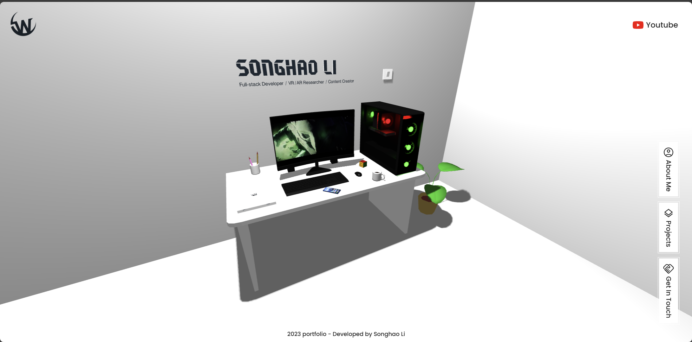
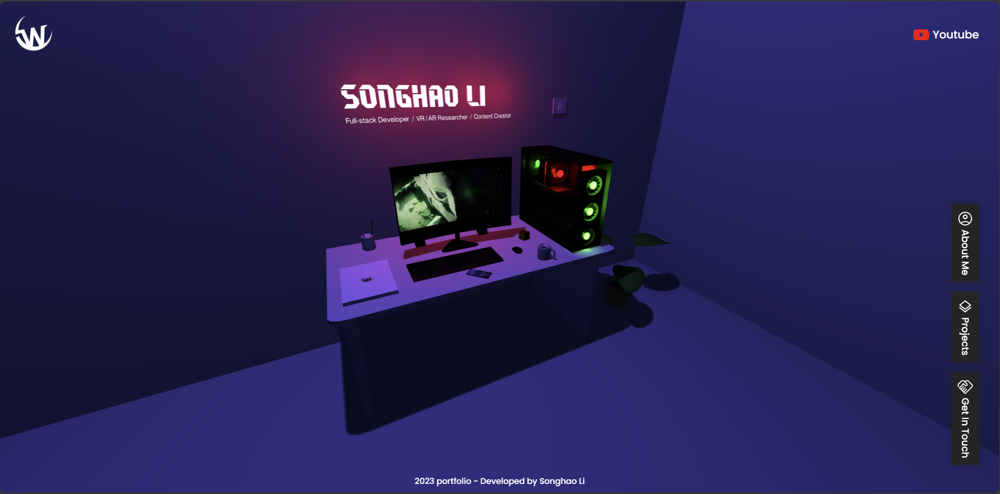

# Immersive Portfolio Website

This project is a immersive portfolio website. You can view this portfolio according to [Songhao's immersive blog](https://songhao-li.github.io/immersivePortfolio/)

Built using:

- Front-end library: React
- 3D graphics library: Three.js

In the /personal-portfolio, you can run:

### `npm run dev`

Runs the app in the development mode.\
Open [http://localhost:3000](http://localhost:3000) to view it in your browser.

The page will reload when you make changes.\
You may also see any lint errors in the console.
